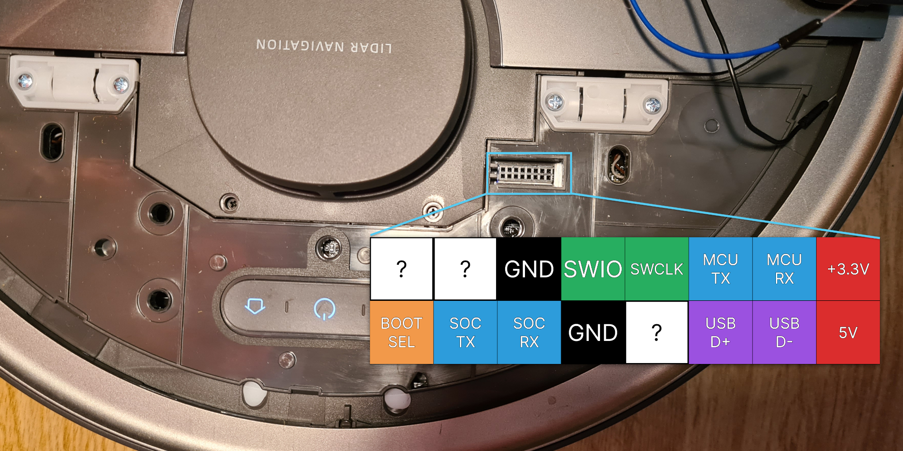
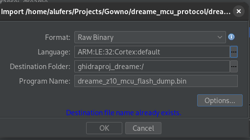
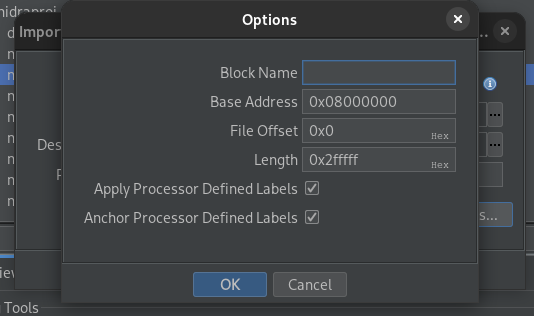

# libs used

- http://ceres-solver.org/nnls_solving.html
- opencv (`opencv4/opencv2/core/mat.inl.hpp`)
- https://github.com/floatlazer/semantic_slam

- https://libserial.readthedocs.io/en/latest/tutorial.html

# sensors/ICs used

- GD32F103ZET6 or GD32F303ZET6 main MCU
- XV7001 - Gyroscope https://support.epson.biz/td/api/doc_check.php?dl=brief_XV7001BB&lang=en
- BMI055 - IMU https://www.bosch-sensortec.com/media/boschsensortec/downloads/datasheets/bst-bmi055-ds000.pdf
- QMCX983 - compass https://github.com/rock12/ALPS.L1.MP6.V2.19_CENON6580_WE_1_L_KERNEL/blob/master/drivers/misc/mediatek/magnetometer/qmcX983/qmcX983.c
- PAA5501 ?

## Serial ports

- `/dev/ttyS4` - MCU (baudrate 115200)
- `/dev/ttyS3` - LDS (baudrate 230400)

## Dumping the MCU flash



Connect SWDIO, SWCLK, GND and 3.3V (to VTref) to the J-Link.

1. Connect to SWD of the MCU using a J-Link (you can probably use a St-Link clone or blackmagic probe as well, but the dumping process will differ)
2. Run JLinkExe
4. `connect`
5. Select `GD32F303ZE`
6. Use SWD and 4000 kHz
7. `SaveBin dump.bin 0x08000000 0x2fffff`

Aaaaand it errored out. Unfortunately Dreame has locked down the flash readout feature. Still it was worth a try.

After some digging I've found out that a copy of the firmware is stored in /mcu.bin on the SoC. It can be copied over and analyzed with Ghidra.

## Analyzing the MCU firmware

The firmware image can be directly imported into Ghidra and analyzed.

The SVD-Loader script is recommended for analyzing the firmware, as it annotates memory ranges with peripheral names, so you have some idea what the code does. It can be found here:
https://github.com/leveldown-security/SVD-Loader-Ghidra

The SVD file for the GD32F303 can be found here:
https://www.keil.com/dd2/gigadevice/gd32f303ze/

To get the SVD file you need to download the Device Family Pack, extract it using 7z and find the SVD file.
After that open it in a text editor and remove the leading spaces, because it makes the Python XML parser fail.





1. Import the file `mcu.bin` into your Ghidra project
2. In the import dialog select "Raw Binary" for the language select "ARM Cortex (little endian)"
3. Hit "Options"
4. Enter `0x08000000` for the base address
5. Import the file
6. If you want to use SVD-Loader do not analyze the file yet. Instead run the SVD-Loader script before analysis.

## MCU firmware

The MCU appears to be running FreeRTOS. It runs a few tasks concurrently 

| Task name | Description |
|-----------|-------------|
| `watchDog` |  |
| `fastSensor` | Sends Triggers packet, detects the carpet.  |
| `cli` |  |
| `ldsStamp` |  |
| `log` |  |
| `state` |  |
| `slowSensor` | Sends packet type 0x26 |
| `imu` | Sends the `Status10ms` message. |
| `motorCtrl` |  |
| `comRxd` | Receives data from the SoC and dispatches them to the appropriate handler. |
| `comTxd` (started by com RxD) | Reads data from the queue of packets to send and sends them to the SoC. |
| `EKF` | Monitor the battery current and voltage. |
| `lineLaser` |  |
| `comTxd` |  |

| Timer name | Description |
|------------|-------------|
| `comTimer` | Runs every 100ms, sends `Status100ms` and  `Triggers`, `0x05`, `0x0f` (every 500ms),  |

| USART name | Description |
|------------|-------------|
| `USART0`   | Communication with the mcu  |
| `USART1`   | CLI interface (exposed on the header) |
| `USART2`   | Communication with the LDS ? |

## AVA nodes

The application running on the robot's SoC (AVA) is composed of several nodes, which communicate which each other using an IPC bus. Each of these nodes runs in a separate thread and is responsible for a specific task. This is probably done to make development of the software easier, as each node can be developed independently. In addition it appears that Dreame developers have a way to run some of the nodes on their workstations instead of the robot, which is probably done for debugging purposes.

The .so files for each node are located in `/ava/lib/`. 

The nodes are:

| Node name | Description |
|-----------|-------------|
| `node_com.so` | Communicates with the robot's MCU over a serial port. It only handles connecting to the serial port, packetizing and checksuming the messages. It appears that it doesn't understand the contents of the packets. |
| `node_cmd.so` | Process commands from `avacmd` (This node listens for commands on a unix socket at `/tmp/avacmd.socket`) |
| `node_log.so` | Crash handling, includes [Google breakpad](https://chromium.googlesource.com/breakpad/breakpad/) |
| `node_lds.so` | Handles serial communication with the LDS (Lidar) sensor. |

# Lidar sensor protocol

The data received from the lidar appears to be also framed, but differently than that from the MCU.
The frame consists of 38 bytes, received over a serial communication interface. The format of the frame is as follows:

The first byte is a header byte with the value 0x55.
The second byte is a header byte with the value 0xaa.
The next 36 bytes are data bytes.

# LDS calibration

```json
{
    "x": 0.05000000074505806,
    "y": 0.0,
    "theta": -117.59664916992188,
    "pillar": {
        "number": 3,
        "value": [ 14, 28, 76, 91, 134, 148, 196, 211, 254, 268, 316, 331 ]
    },
    "type": 0
}
```

Sent using message 0x10

# avacmd commands

avacmd is used to inject debug commands into the IPC mechanism of the robot. 

## camera

```
avacmd camera_laser '{"cmd":"get_camera_state"}'
avacmd camera_laser '{"cmd":"open_camera"}'
avacmd camera_laser '{"cmd":"take_photo", "path":"/tmp/photo.bmp"}'
avacmd camera_laser '{"cmd":"close_camera"}'
```

## sys
```
avacmd sys '{"type":"system", "sys_get":"get_all"}'
```


## ota
```
avacmd ota '{"type": "ota", "cmd": "report_upgrade_status", "status": "AVA_UNPACK_OK", "result": "ok"}'
```

## iot
```
avacmd iot '{"type":"iot", "notify":"close_server"}'
avacmd iot '{"type":"iot", "notify":"open_server"}' 
```

## msg_cvt

Front facing camera

```
avacmd msg_cvt '{"type":"msgCvt","cmd":"config_tz"}' &

avacmd msg_cvt '{"type":"msgCvt", "cmd":"status_idle"}'
avacmd msg_cvt "${MSG}" "{\"type\":\"msgCvt\",\"cmd\":\"upload_iot_events\",\"events\":\""
avacmd msg_cvt '{"type":"msgCvt","cmd":"nation_matched","result":"mismatched"}'

{"type":"msgCvt", "cmd":"calibration","value":"gyro20"}
{"type":"msgCvt", "cmd":"calibration","value":"light10"}
{"type":"msgCvt", "cmd":"calibration","value":"light20"}
{"type":"msgCvt", "cmd":"calibration","value":"gyro21"}
{"type":"msgCvt", "cmd":"calibration","value":"light11"}
{"type":"msgCvt", "cmd":"calibration","value":"light21"}

avacmd msg_cvt '{"method":"get_properties","params":[{"siid":4,"piid":1,"did":521229396},{"siid":4,"piid":7,"did":521229396},{"siid":4,"piid":4,"
did":521229396},{"siid":4,"piid":5,"did":521229396},{"siid":4,"piid":6,"did":521229396},{"siid":4,"piid":18,"did":521229396},{"siid":3,"piid":1,"did":521229396},{"siid":
3,"piid":2,"did":521229396}],"id":5340}'
RESPONSE: 
{"id":5340,"result":[{"siid":4,"did":"521229396","piid":1,"value":14,"code":0},{"siid":4,"did":"521229396","piid":7,"value":0,"code":0},{"siid":4,"did":"521229396","piid":4,"value":3,"code":0},{"siid":4,"did":"521229396","piid":5,"value":2,"code":0},{"siid":4,"did":"521229396","piid":6,"value":0,"code":0},{"siid":4,"did":"521229396","piid":18,"value":"0","code":0},{"siid":3,"did":"521229396","piid":1,"value":100,"code":0},{"siid":3,"did":"521229396","piid":2,"value":1,"code":0}]}


avacmd msg_cvt '{"method": "local.status", "params": "cloud_retry"}}'
msg_cvt{\"type\":\"fds_mult_map_put\", \"md5\":\"cf236cbd144c5e7ba5b9fadb49dd1345\", \"ret\":\"ok\"}
```


## clb

```
avacmd clb "{\"type\":\"system\",\"key\":\"nq\",\"value\":\"[${MSG}]\"}"
avacmd clb "{\"type\":\"system\",\"key\":\"sys_info\",\"value\":\"{${MSG_DATA}}\"}"
 <dict>
```

## media

```
avacmd media '{"type":"media","cmd":"status_get"}'
```


# Interesting files


/mnt/misc/lds_name - laser type

